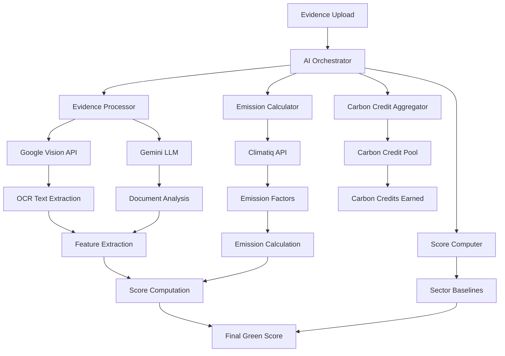

# HaliCred AI Pipeline Documentation

## Overview

The HaliCred AI pipeline is a sophisticated system that processes sustainability evidence from SMEs and converts it into quantifiable green scores and carbon credit calculations. The pipeline integrates multiple AI services to provide comprehensive analysis and scoring.

## AI Architecture



## Core AI Components

### 1. AI Orchestrator
**Location**: `backend/app/ai/orchestrator.py`

The central coordinator that manages the entire AI processing pipeline.

#### Key Features:
- **Function Calling**: Uses Gemini's function calling capabilities
- **Deterministic Fallbacks**: Ensures reliability when AI services are unavailable
- **Microservice Coordination**: Orchestrates multiple AI components
- **Error Handling**: Comprehensive error recovery and logging

#### Configuration:
```python
ai_config = {
    'gemini_api_key': os.getenv("GEMINI_API_KEY"),
    'google_vision_api_key': os.getenv("GOOGLE_VISION_API_KEY"),
    'climatiq_api_key': os.getenv("CLIMATIQ_API_KEY")
}
```

### 2. Evidence Processor
**Location**: `backend/app/ai/evidence_processor.py`

Processes uploaded files and extracts sustainability-related features.

#### Processing Pipeline:
1. **File Acquisition**: Downloads from local path or HTTP URL
2. **Google Vision Processing**: OCR and computer vision analysis
3. **Feature Extraction**: Identifies sustainability indicators
4. **Content Validation**: Verifies evidence authenticity

#### Supported File Types:
- Images: JPEG, PNG, WEBP
- Documents: PDF, TIFF
- Maximum size: 20MB per file

#### Features Extracted:
- **Equipment Types**: Solar panels, LED lights, efficient appliances
- **Financial Data**: Purchase amounts, dates, supplier information
- **Sustainability Metrics**: Energy ratings, efficiency specifications
- **Geographic Data**: Location-based context

### 3. Emission Calculator
**Location**: `backend/app/ai/emission_calculator.py`

Calculates carbon emissions and reductions using Climatiq API.

#### Integration Points:
- **Climatiq GA API**: `/data/v1/search` for emission factors
- **Emission Estimation**: `/data/v1/estimate` for calculations
- **Kenya-Specific Data**: Regional emission factors

#### Calculation Process:
1. **Activity Identification**: Maps evidence to emission activities
2. **Factor Lookup**: Retrieves appropriate emission factors
3. **Baseline Calculation**: Determines pre-intervention emissions
4. **Reduction Calculation**: Quantifies emission reductions

#### Example Calculation:
```python
# Solar panel installation
activity_data = {
    "activity_id": "electricity_grid_ke",
    "data_version": "2023.1",
    "amount": 1000,  # kWh saved annually
    "unit": "kWh"
}
emissions_saved = calculator.calculate_reduction(activity_data)
# Result: 850.5 kg CO2 saved annually
```

### 4. Score Computer
**Location**: `backend/app/ai/score_computation.py`

Converts emissions data and features into weighted green scores.

#### Scoring Pillars:
1. **Energy Efficiency** (25% weight)
   - Renewable energy adoption
   - Energy-efficient equipment
   - Energy conservation practices

2. **Waste Management** (20% weight)
   - Waste reduction initiatives
   - Recycling programs
   - Circular economy practices

3. **Sustainable Practices** (25% weight)
   - Sustainable sourcing
   - Environmental certifications
   - Green business operations

4. **Carbon Footprint** (30% weight)
   - Emission reductions
   - Carbon-neutral initiatives
   - Climate impact mitigation

#### Scoring Algorithm:
```python
def calculate_weighted_score(pillar_scores, weights):
    """
    Calculate weighted green score from pillar scores
    """
    weighted_sum = sum(score * weight for score, weight in zip(pillar_scores, weights))
    return min(100, max(0, weighted_sum))
```

### 5. Carbon Credit Aggregator
**Location**: `backend/app/ai/carbon_credit.py`

Generates carbon credit projections and pooling summaries.

#### Credit Calculation:
- **Methodology**: VCS (Verified Carbon Standard) aligned
- **Verification**: AI-based evidence validation
- **Pooling**: Aggregates credits across multiple SMEs
- **Trading Ready**: Prepares credits for carbon markets

#### Credit Types:
- **Renewable Energy**: Solar, wind, biogas installations
- **Energy Efficiency**: LED lighting, efficient appliances
- **Waste Management**: Composting, methane capture
- **Sustainable Transport**: Electric vehicles, public transport

## AI Service Integrations

### Google Gemini
**Model**: `models/gemini-2.5-flash`
**Purpose**: LLM orchestration and function calling

#### Capabilities:
- **Document Understanding**: Analyzes evidence content
- **Function Calling**: Orchestrates AI pipeline components
- **Reasoning**: Interprets sustainability evidence
- **Validation**: Verifies evidence authenticity

#### API Usage:
```python
response = gemini_client.generate_content([
    {
        "role": "user",
        "parts": [{"text": prompt}]
    }
],
tools=[function_definitions])
```

### Google Vision API
**Purpose**: OCR and computer vision analysis

#### Services Used:
- **TEXT_DETECTION**: Extract text from images
- **OBJECT_LOCALIZATION**: Identify sustainability equipment
- **LABEL_DETECTION**: Classify evidence types
- **LOGO_DETECTION**: Verify suppliers and brands

#### Authentication:
- Service account JSON: `backend/keys/google-vision.json`
- Environment variable: `GOOGLE_APPLICATION_CREDENTIALS`

### Climatiq API
**Purpose**: Emission factor data and calculations

#### Endpoints:
- **Search**: `/data/v1/search` - Find emission factors
- **Estimate**: `/data/v1/estimate` - Calculate emissions

#### Data Sources:
- **IPCC Guidelines**: International emission factors
- **Regional Data**: Kenya-specific electricity grid factors
- **Activity Database**: 15,000+ emission activities

## AI Processing Flow

### 1. Evidence Submission
```http
POST /ai/evidence/process
Content-Type: multipart/form-data

file: solar_panel_receipt.jpg
sector: agriculture
region: Kenya
evidence_type: renewable_energy
description: Solar panel installation receipt
```

### 2. AI Orchestration
```python
async def process_evidence_request(evidence_data):
    # 1. Initialize AI components
    orchestrator = AIOrchestrator(config)

    # 2. Process evidence
    processing_result = await orchestrator.process_evidence(evidence_data)

    # 3. Calculate scores
    green_score = await orchestrator.calculate_green_score(processing_result)

    # 4. Generate carbon credits
    carbon_credits = await orchestrator.calculate_carbon_credits(processing_result)

    return {
        "processing_results": processing_result,
        "green_score": green_score,
        "carbon_credits": carbon_credits
    }
```

### 3. Processing Pipeline
1. **File Processing**: Extract text and identify objects
2. **Feature Analysis**: Analyze sustainability features
3. **Emission Calculation**: Calculate carbon impact
4. **Score Computation**: Generate green score
5. **Credit Calculation**: Calculate carbon credits
6. **Result Aggregation**: Combine all results

### 4. Response Format
```json
{
  "ai_evidence_id": "uuid-string",
  "status": "completed",
  "confidence_score": 0.89,
  "processing_results": {
    "emission_reduction": 2.5,
    "green_score_impact": 15.2,
    "carbon_credits": 0.8,
    "features_detected": {
      "equipment_type": "solar_panel",
      "capacity": "5kW",
      "efficiency": "22%",
      "supplier": "verified"
    }
  },
  "ai_insights": {
    "evidence_validity": "high",
    "sustainability_impact": "significant",
    "recommendations": [
      "Consider expanding solar capacity",
      "Add battery storage for higher efficiency"
    ]
  }
}
```

## Confidence Management

### Confidence Scoring
**Location**: `backend/app/ai/confidence_manager.py`

#### Factors Considered:
- **Image Quality**: Resolution, clarity, lighting
- **Text Readability**: OCR confidence scores
- **Content Validation**: Cross-reference with known patterns
- **Source Verification**: Supplier and vendor validation

#### Confidence Levels:
- **High (80-100%)**: Clear evidence, verified sources
- **Medium (60-79%)**: Good evidence, minor uncertainty
- **Low (40-59%)**: Unclear evidence, requires manual review
- **Very Low (<40%)**: Insufficient evidence, likely rejected

### Fallback Mechanisms
1. **AI Service Failures**: Deterministic scoring when APIs unavailable
2. **Low Confidence**: Human review workflows
3. **Data Quality Issues**: Request additional evidence
4. **Regional Limitations**: Default to global emission factors

## Sector Baselines

### Supported Sectors
**Location**: `backend/app/ai/sector_baseline.py`

#### Agriculture
- **Irrigation**: Drip irrigation, rainwater harvesting
- **Energy**: Solar water pumps, biogas digesters
- **Transport**: Electric farm equipment
- **Baseline Score**: 45-55 points

#### Manufacturing
- **Energy**: Solar installations, efficient motors
- **Waste**: Recycling programs, waste reduction
- **Processes**: Clean production technologies
- **Baseline Score**: 40-50 points

#### Transport
- **Vehicles**: Electric vehicles, hybrid technology
- **Fuel**: Biofuels, compressed natural gas
- **Operations**: Route optimization, load efficiency
- **Baseline Score**: 35-45 points

#### Services
- **Buildings**: Green building certifications
- **Energy**: LED lighting, HVAC efficiency
- **Operations**: Digital transformation, paperless
- **Baseline Score**: 50-60 points

## Performance Monitoring

### AI Pipeline Metrics
- **Processing Time**: Average 30-45 seconds per evidence
- **Success Rate**: 95%+ successful processing
- **Confidence Distribution**: 80% high confidence results
- **API Response Times**: <2 seconds per API call

### Quality Assurance
- **Manual Validation**: Sample-based quality checks
- **A/B Testing**: Compare AI vs human scoring
- **Continuous Learning**: Model improvement based on feedback
- **Error Analysis**: Regular review of failed cases

## Data Privacy and Security

### Privacy Protection
- **Data Minimization**: Only process necessary information
- **Anonymization**: Remove personally identifiable information
- **Retention Limits**: Delete processed files after analysis
- **Consent Management**: Respect user privacy preferences

### Security Measures
- **API Key Rotation**: Regular rotation of AI service keys
- **Encrypted Storage**: All evidence files encrypted
- **Access Logging**: Comprehensive audit trails
- **Rate Limiting**: Prevent abuse and ensure availability

## Troubleshooting

### Common Issues

#### Low Confidence Scores
**Cause**: Poor image quality or unclear documentation
**Solution**:
- Request higher quality images
- Provide additional evidence
- Manual review workflow

#### API Rate Limits
**Cause**: Exceeding AI service quotas
**Solution**:
- Implement exponential backoff
- Queue processing for peak times
- Use caching for repeated requests

#### Emission Factor Mismatches
**Cause**: Activity not found in Climatiq database
**Solution**:
- Use closest equivalent activity
- Default to regional averages
- Manual factor assignment

### Error Codes
- **AI_001**: Gemini API unavailable
- **AI_002**: Google Vision processing failed
- **AI_003**: Climatiq API rate limit exceeded
- **AI_004**: Low confidence evidence
- **AI_005**: Unsupported file format

## Future Enhancements

### Phase 8 Improvements
- **Advanced ML Models**: Custom-trained models for Kenya context
- **Real-time Processing**: Stream processing for faster results
- **Multi-language Support**: Process documents in Swahili
- **Mobile Integration**: On-device processing capabilities

### Model Training
- **Custom OCR**: Train on local receipts and documents
- **Emission Models**: Kenya-specific emission factor models
- **Scoring Algorithms**: Sector-specific scoring improvements
- **Validation Models**: Automated evidence authenticity detection

---

**Last Updated**: September 30, 2025
**AI Pipeline Version**: 7.0.0
**Model Versions**: Gemini-2.5-flash, Vision API v1, Climatiq GA 2023.1