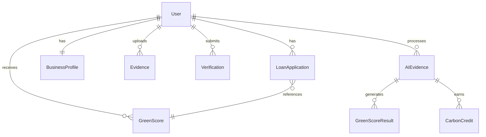

# HaliCred Database Schema Documentation

## Overview

The HaliCred platform uses PostgreSQL as the primary database with SQLAlchemy ORM for data modeling. The schema is designed to support AI-powered green credit scoring, evidence management, and loan processing.

## Database Architecture

- **Database**: PostgreSQL 15+
- **ORM**: SQLAlchemy 2.0
- **Migrations**: Alembic
- **Extensions**: PostGIS (for geospatial data)

## Core Tables

### Users Table
**Table**: `users`

Stores user account information for SMEs, banks, and administrators.

| Column | Type | Constraints | Description |
|--------|------|-------------|-------------|
| id | UUID | PRIMARY KEY | Unique user identifier |
| phone | VARCHAR(32) | UNIQUE, NOT NULL | User's phone number |
| full_name | VARCHAR(120) | NOT NULL | User's full name |
| roles | VARCHAR[] | DEFAULT ['borrower'] | User roles array |
| created_at | TIMESTAMP | DEFAULT NOW() | Account creation timestamp |

**Relationships**:
- One-to-One: `BusinessProfile`
- One-to-Many: `LoanApplication`, `Verification`, `GreenScore`, `Evidence`

### Business Profiles Table
**Table**: `business_profiles`

Stores business-specific information for SME users.

| Column | Type | Constraints | Description |
|--------|------|-------------|-------------|
| user_id | UUID | PRIMARY KEY, FK(users.id) | Reference to user |
| business_type | ENUM | - | Type of business (agriculture, beauty, welding, other) |
| business_name | VARCHAR(160) | - | Name of the business |
| location | GEOMETRY(POINT) | - | Geographic location (lat/lng) |
| consents | JSONB | - | User consent preferences |

**Relationships**:
- One-to-One: `User`

### Loan Applications Table
**Table**: `loan_applications`

Tracks loan applications and their processing status.

| Column | Type | Constraints | Description |
|--------|------|-------------|-------------|
| id | UUID | PRIMARY KEY | Unique application identifier |
| user_id | UUID | FK(users.id), INDEX | Reference to user |
| amount | NUMERIC(14,2) | - | Loan amount requested |
| tenor_months | INTEGER | - | Loan term in months |
| quoted_rate | NUMERIC(6,4) | - | Interest rate quoted |
| greenscore_snapshot | JSONB | - | GreenScore at application time |
| status | ENUM | - | Application status |
| created_at | TIMESTAMP | DEFAULT NOW() | Application creation timestamp |

**Status Values**: `draft`, `submitted`, `approved`, `declined`, `disbursed`

**Relationships**:
- Many-to-One: `User`

### Evidence Table
**Table**: `evidence`

Stores uploaded evidence files and their processing status.

| Column | Type | Constraints | Description |
|--------|------|-------------|-------------|
| id | UUID | PRIMARY KEY | Unique evidence identifier |
| user_id | UUID | FK(users.id), INDEX | Reference to user |
| s3_key | VARCHAR | NOT NULL | S3 storage key for file |
| status | ENUM | INDEX | Processing status |
| created_at | TIMESTAMP | DEFAULT NOW() | Upload timestamp |

**Status Values**: `pending`, `processing`, `verified`, `rejected`

**Relationships**:
- Many-to-One: `User`

### Verifications Table
**Table**: `verifications`

Legacy table for evidence verification (superseded by AI evidence processing).

| Column | Type | Constraints | Description |
|--------|------|-------------|-------------|
| id | UUID | PRIMARY KEY | Unique verification identifier |
| user_id | UUID | FK(users.id), INDEX | Reference to user |
| kind | ENUM | - | Type of verification |
| status | ENUM | INDEX | Processing status |
| s3_key | VARCHAR | NOT NULL | S3 storage key |
| receipt_hash | VARCHAR(64) | - | Hash of receipt content |
| parsed | JSONB | - | Parsed data from document |
| result | JSONB | - | Verification results |
| created_at | TIMESTAMP | DEFAULT NOW() | Creation timestamp |

**Kind Values**: `receipt`, `photo`, `geo`, `transaction`, `telemetry`
**Status Values**: `pending`, `processing`, `verified`, `rejected`

### Green Scores Table
**Table**: `greenscores`

Stores calculated green scores and their components.

| Column | Type | Constraints | Description |
|--------|------|-------------|-------------|
| id | UUID | PRIMARY KEY | Unique score identifier |
| user_id | UUID | FK(users.id), INDEX | Reference to user |
| score | INTEGER | NOT NULL | Overall green score (0-100) |
| subscores | JSONB | - | Breakdown by category |
| explanation_json | JSONB | - | Score explanation and factors |
| computed_at | TIMESTAMP | DEFAULT NOW() | Score calculation timestamp |

**Relationships**:
- Many-to-One: `User`

### Audit Logs Table
**Table**: `audit_logs`

Comprehensive audit trail for all system actions.

| Column | Type | Constraints | Description |
|--------|------|-------------|-------------|
| id | UUID | PRIMARY KEY | Unique log identifier |
| actor_user_id | UUID | NULLABLE | User who performed action |
| action | VARCHAR(80) | - | Action performed |
| entity | VARCHAR(80) | - | Entity type affected |
| entity_id | UUID | - | Specific entity affected |
| payload | JSONB | - | Action details and data |
| audit_hmac | VARCHAR(64) | - | HMAC for integrity verification |
| created_at | TIMESTAMP | DEFAULT NOW() | Action timestamp |

## AI Models Tables

### AI Evidence Table
**Table**: `ai_evidence`

Stores AI processing results for uploaded evidence.

| Column | Type | Constraints | Description |
|--------|------|-------------|-------------|
| id | UUID | PRIMARY KEY | Unique AI evidence identifier |
| user_id | UUID | FK(users.id) | Reference to user |
| file_url | VARCHAR | - | URL to uploaded file |
| sector | VARCHAR | - | Business sector |
| region | VARCHAR | - | Geographic region |
| evidence_type | VARCHAR | - | Type of evidence |
| status | ENUM | - | Processing status |
| confidence_score | FLOAT | - | AI confidence level |
| processing_results | JSONB | - | Detailed AI analysis results |
| created_at | TIMESTAMP | DEFAULT NOW() | Processing timestamp |
| updated_at | TIMESTAMP | - | Last update timestamp |

### Green Score Results Table
**Table**: `green_score_results`

Stores detailed green score calculations from AI processing.

| Column | Type | Constraints | Description |
|--------|------|-------------|-------------|
| id | UUID | PRIMARY KEY | Unique result identifier |
| ai_evidence_id | UUID | FK(ai_evidence.id) | Reference to AI evidence |
| user_id | UUID | FK(users.id) | Reference to user |
| overall_score | FLOAT | - | Overall green score |
| pillar_scores | JSONB | - | Scores by sustainability pillar |
| confidence_level | VARCHAR | - | Confidence assessment |
| factors_considered | JSONB | - | Factors in score calculation |
| recommendations | JSONB | - | AI recommendations |
| created_at | TIMESTAMP | DEFAULT NOW() | Calculation timestamp |

### Carbon Credits Table
**Table**: `carbon_credits`

Tracks carbon credit calculations and projections.

| Column | Type | Constraints | Description |
|--------|------|-------------|-------------|
| id | UUID | PRIMARY KEY | Unique credit identifier |
| ai_evidence_id | UUID | FK(ai_evidence.id) | Reference to AI evidence |
| user_id | UUID | FK(users.id) | Reference to user |
| credits_earned | FLOAT | - | Carbon credits earned |
| emission_reduction | FLOAT | - | CO2 reduction in tonnes |
| calculation_method | VARCHAR | - | Method used for calculation |
| verification_status | VARCHAR | - | Credit verification status |
| created_at | TIMESTAMP | DEFAULT NOW() | Calculation timestamp |

## Data Relationships



## Indexes

### Performance Indexes
- `users.phone` - Unique index for phone lookup
- `evidence.user_id` - Index for user evidence queries
- `evidence.status` - Index for status filtering
- `loan_applications.user_id` - Index for user loan queries
- `greenscores.user_id` - Index for user score queries
- `verifications.status` - Index for verification status queries

### Composite Indexes
- `(user_id, created_at)` on multiple tables for timeline queries
- `(status, created_at)` for processing queue optimization

## Data Types and Enums

### Business Types
```sql
CREATE TYPE business_type_enum AS ENUM (
    'agriculture',
    'beauty',
    'welding',
    'other'
);
```

### Loan Status
```sql
CREATE TYPE loan_status AS ENUM (
    'draft',
    'submitted',
    'approved',
    'declined',
    'disbursed'
);
```

### Evidence Status
```sql
CREATE TYPE evidence_status AS ENUM (
    'pending',
    'processing',
    'verified',
    'rejected'
);
```

### Verification Kind
```sql
CREATE TYPE verification_kind AS ENUM (
    'receipt',
    'photo',
    'geo',
    'transaction',
    'telemetry'
);
```

### Verification Status
```sql
CREATE TYPE verification_status AS ENUM (
    'pending',
    'processing',
    'verified',
    'rejected'
);
```

## JSONB Schema Examples

### GreenScore Subscores
```json
{
  "energy_efficiency": 85.0,
  "waste_management": 72.0,
  "sustainable_practices": 80.0,
  "carbon_footprint": 75.0
}
```

### Business Profile Consents
```json
{
  "data_sharing": true,
  "marketing_communications": false,
  "ai_processing": true,
  "carbon_credit_sharing": true
}
```

### Loan Application GreenScore Snapshot
```json
{
  "score": 78,
  "pillars": {
    "energy": 80,
    "waste": 75,
    "sustainability": 82
  },
  "evidence_count": 5,
  "last_updated": "2025-09-30T10:00:00Z"
}
```

### AI Processing Results
```json
{
  "ocr_text": "Solar panel installation receipt...",
  "ai_analysis": "High-quality renewable energy evidence",
  "emission_reduction": 2.5,
  "confidence_factors": ["clear_image", "valid_supplier"],
  "sustainability_impact": "significant"
}
```

## Migration Management

### Alembic Configuration
- Migrations stored in `backend/alembic/versions/`
- Environment configuration in `backend/alembic/env.py`
- Auto-generated migrations with manual review required

### Key Migrations
1. `001_add_ai_models.py` - Added AI processing tables
2. `002_add_email_to_users.py` - Extended user information
3. `003_add_auth_columns.py` - Enhanced authentication
4. `004_convert_roles_to_jsonb.py` - Improved role management

## Data Backup and Recovery

### Backup Strategy
- Daily automated backups of full database
- Point-in-time recovery enabled
- Cross-region backup replication for disaster recovery

### Retention Policy
- Daily backups: 30 days
- Weekly backups: 12 weeks
- Monthly backups: 12 months
- Annual backups: 7 years

## Security Considerations

### Data Protection
- All sensitive data encrypted at rest
- Phone numbers hashed for privacy
- GDPR compliance for data retention
- Audit logs for all data access

### Access Control
- Role-based access control (RBAC)
- Database connection pooling
- SSL/TLS encryption for connections
- Regular security audits

## Performance Optimization

### Query Optimization
- Appropriate indexes on frequently queried columns
- JSONB GIN indexes for complex queries
- Query plan analysis and optimization
- Connection pooling for high throughput

### Monitoring
- Slow query log analysis
- Database performance metrics
- Connection pool monitoring
- Disk space and growth tracking

---

**Last Updated**: September 30, 2025
**Schema Version**: 7.0.0
**Database Version**: PostgreSQL 15.4