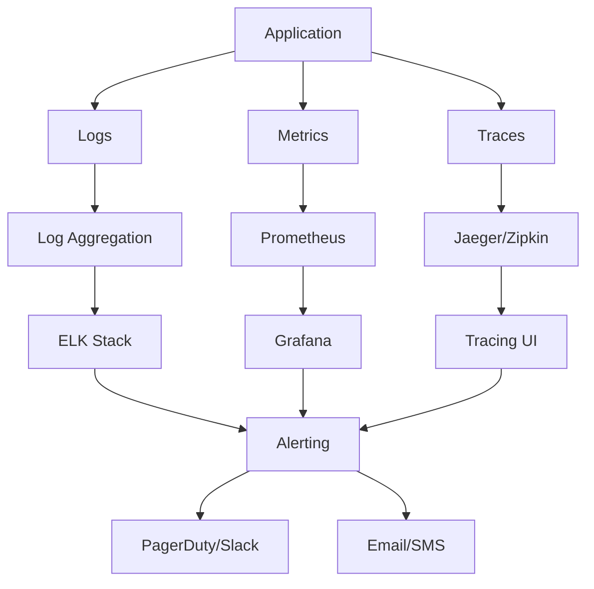

# HaliCred Monitoring and Operations Runbook

## Overview

This runbook provides comprehensive monitoring, alerting, and operational procedures for the HaliCred platform. It covers system health monitoring, performance metrics, incident response, and maintenance procedures.

## Monitoring Architecture



## Health Check Endpoints

### Application Health Checks

#### Primary Health Check
```http
GET /health
```

**Expected Response**:
```json
{
  "status": "healthy",
  "timestamp": "2025-09-30T10:00:00Z",
  "version": "7.0.0",
  "environment": "production"
}
```

#### Database Health Check
```http
GET /health/db
```

**Expected Response**:
```json
{
  "status": "healthy",
  "database": "connected",
  "connection_pool": {
    "active": 5,
    "idle": 15,
    "total": 20
  },
  "response_time_ms": 12
}
```

#### AI Services Health Check
```http
GET /health/ai
```

**Expected Response**:
```json
{
  "status": "healthy",
  "services": {
    "gemini": {
      "status": "connected",
      "response_time_ms": 156,
      "last_check": "2025-09-30T09:59:45Z"
    },
    "google_vision": {
      "status": "connected",
      "response_time_ms": 89,
      "last_check": "2025-09-30T09:59:45Z"
    },
    "climatiq": {
      "status": "connected",
      "response_time_ms": 234,
      "last_check": "2025-09-30T09:59:45Z"
    }
  }
}
```

#### Redis Health Check
```http
GET /health/redis
```

**Expected Response**:
```json
{
  "status": "healthy",
  "redis": "connected",
  "memory_usage": "45.2MB",
  "connected_clients": 12,
  "response_time_ms": 3
}
```

## Key Performance Indicators (KPIs)

### Application Metrics

#### Response Time Metrics
- **API Response Time**: Target < 500ms (95th percentile)
- **Database Query Time**: Target < 100ms (average)
- **AI Processing Time**: Target < 30s (average)
- **File Upload Time**: Target < 10s (for 5MB files)

#### Throughput Metrics
- **Requests per Second**: Monitor peak and average
- **Evidence Processing Rate**: Target 100 files/hour
- **Green Score Calculations**: Target 200 calculations/hour
- **Concurrent Users**: Monitor active sessions

#### Error Metrics
- **Error Rate**: Target < 1%
- **5xx Errors**: Target < 0.1%
- **4xx Errors**: Monitor for authentication issues
- **Failed AI Requests**: Target < 5%

### Infrastructure Metrics

#### System Resources
- **CPU Usage**: Alert at 80%, Critical at 90%
- **Memory Usage**: Alert at 85%, Critical at 95%
- **Disk Usage**: Alert at 80%, Critical at 90%
- **Network I/O**: Monitor for bottlenecks

#### Database Metrics
- **Connection Count**: Monitor vs max_connections
- **Query Performance**: Slow queries > 1s
- **Cache Hit Ratio**: Target > 95%
- **Replication Lag**: Target < 1s

#### External Services
- **AI Service Response Times**: Monitor trends
- **API Rate Limits**: Track usage vs limits
- **Service Availability**: Track uptime percentages

## Monitoring Setup

### 1. Prometheus Configuration

Create `/opt/halicred/monitoring/prometheus.yml`:
```yaml
global:
  scrape_interval: 15s
  evaluation_interval: 15s

rule_files:
  - "rules/*.yml"

scrape_configs:
  - job_name: 'halicred-backend'
    static_configs:
      - targets: ['backend:8000']
    metrics_path: '/metrics'
    scrape_interval: 15s

  - job_name: 'postgresql'
    static_configs:
      - targets: ['postgres-exporter:9187']

  - job_name: 'redis'
    static_configs:
      - targets: ['redis-exporter:9121']

  - job_name: 'nginx'
    static_configs:
      - targets: ['nginx-exporter:9113']

  - job_name: 'node'
    static_configs:
      - targets: ['node-exporter:9100']

alerting:
  alertmanagers:
    - static_configs:
        - targets:
          - alertmanager:9093
```

### 2. Grafana Dashboards

#### System Overview Dashboard
**Dashboard ID**: halicred-system-overview

**Key Panels**:
- Request rate and response time
- Error rate trends
- System resource utilization
- Database performance metrics
- AI service status

#### Application Performance Dashboard
**Dashboard ID**: halicred-app-performance

**Key Panels**:
- API endpoint performance
- Evidence processing metrics
- Green score calculation rates
- User activity metrics
- Cache hit rates

#### Infrastructure Dashboard
**Dashboard ID**: halicred-infrastructure

**Key Panels**:
- Server resource usage
- Database connections and queries
- Redis memory and operations
- Network traffic
- Disk I/O

### 3. Alerting Rules

Create `/opt/halicred/monitoring/rules/alerts.yml`:
```yaml
groups:
  - name: halicred-critical
    rules:
      - alert: APIDown
        expr: up{job="halicred-backend"} == 0
        for: 1m
        labels:
          severity: critical
        annotations:
          summary: "HaliCred API is down"
          description: "API has been down for more than 1 minute"

      - alert: HighErrorRate
        expr: rate(http_requests_total{status=~"5.."}[5m]) > 0.05
        for: 2m
        labels:
          severity: critical
        annotations:
          summary: "High error rate detected"
          description: "Error rate is {{ $value }}% over the last 5 minutes"

      - alert: DatabaseDown
        expr: postgresql_up == 0
        for: 30s
        labels:
          severity: critical
        annotations:
          summary: "Database is down"
          description: "PostgreSQL database is not responding"

      - alert: HighResponseTime
        expr: histogram_quantile(0.95, rate(http_request_duration_seconds_bucket[5m])) > 2
        for: 5m
        labels:
          severity: warning
        annotations:
          summary: "High response time"
          description: "95th percentile response time is {{ $value }}s"

  - name: halicred-resources
    rules:
      - alert: HighCPUUsage
        expr: (100 - (avg by (instance) (irate(node_cpu_seconds_total{mode="idle"}[5m])) * 100)) > 80
        for: 5m
        labels:
          severity: warning
        annotations:
          summary: "High CPU usage"
          description: "CPU usage is {{ $value }}% on {{ $labels.instance }}"

      - alert: HighMemoryUsage
        expr: (1 - (node_memory_MemAvailable_bytes / node_memory_MemTotal_bytes)) * 100 > 85
        for: 5m
        labels:
          severity: warning
        annotations:
          summary: "High memory usage"
          description: "Memory usage is {{ $value }}% on {{ $labels.instance }}"

      - alert: LowDiskSpace
        expr: (1 - (node_filesystem_avail_bytes / node_filesystem_size_bytes)) * 100 > 80
        for: 5m
        labels:
          severity: warning
        annotations:
          summary: "Low disk space"
          description: "Disk usage is {{ $value }}% on {{ $labels.instance }}"
```

### 4. Alertmanager Configuration

Create `/opt/halicred/monitoring/alertmanager.yml`:
```yaml
global:
  smtp_smarthost: 'localhost:587'
  smtp_from: 'alerts@halicred.com'

route:
  group_by: ['alertname']
  group_wait: 10s
  group_interval: 10s
  repeat_interval: 1h
  receiver: 'web.hook'

  routes:
    - match:
        severity: critical
      receiver: 'critical-alerts'
    - match:
        severity: warning
      receiver: 'warning-alerts'

receivers:
  - name: 'web.hook'
    webhook_configs:
      - url: 'http://127.0.0.1:5001/'

  - name: 'critical-alerts'
    slack_configs:
      - api_url: 'YOUR_SLACK_WEBHOOK_URL'
        channel: '#halicred-alerts'
        title: 'Critical Alert'
        text: '{{ range .Alerts }}{{ .Annotations.summary }}{{ end }}'
    email_configs:
      - to: 'oncall@halicred.com'
        subject: 'Critical Alert: {{ .GroupLabels.alertname }}'
        body: |
          {{ range .Alerts }}
          Alert: {{ .Annotations.summary }}
          Description: {{ .Annotations.description }}
          {{ end }}

  - name: 'warning-alerts'
    slack_configs:
      - api_url: 'YOUR_SLACK_WEBHOOK_URL'
        channel: '#halicred-warnings'
        title: 'Warning Alert'
        text: '{{ range .Alerts }}{{ .Annotations.summary }}{{ end }}'
```

## Logging Strategy

### 1. Log Levels and Categories

#### Application Logs
- **ERROR**: System errors, exceptions, failed operations
- **WARN**: Performance issues, degraded functionality
- **INFO**: Normal operations, user actions, system events
- **DEBUG**: Detailed debugging information (development only)

#### Log Categories
- **API**: Request/response logging
- **Auth**: Authentication and authorization events
- **AI**: AI service interactions and results
- **Database**: Query performance and errors
- **Security**: Security-related events and violations

### 2. Structured Logging Format

```json
{
  "timestamp": "2025-09-30T10:00:00.123Z",
  "level": "INFO",
  "category": "API",
  "message": "User authentication successful",
  "request_id": "req-123456789",
  "user_id": "user-uuid",
  "endpoint": "/auth/verify",
  "method": "POST",
  "status_code": 200,
  "response_time_ms": 45,
  "ip_address": "192.168.1.100",
  "user_agent": "HaliCred Mobile App/1.0"
}
```

### 3. Log Collection and Analysis

#### ELK Stack Configuration
```yaml
# docker-compose.logging.yml
elasticsearch:
  image: docker.elastic.co/elasticsearch/elasticsearch:8.5.0
  environment:
    - discovery.type=single-node
    - "ES_JAVA_OPTS=-Xms2g -Xmx2g"
  volumes:
    - es_data:/usr/share/elasticsearch/data

logstash:
  image: docker.elastic.co/logstash/logstash:8.5.0
  volumes:
    - ./logstash/pipeline:/usr/share/logstash/pipeline
    - ./logstash/config:/usr/share/logstash/config

kibana:
  image: docker.elastic.co/kibana/kibana:8.5.0
  ports:
    - "5601:5601"
  environment:
    - ELASTICSEARCH_HOSTS=http://elasticsearch:9200

filebeat:
  image: docker.elastic.co/beats/filebeat:8.5.0
  user: root
  volumes:
    - ./filebeat.yml:/usr/share/filebeat/filebeat.yml:ro
    - /var/lib/docker/containers:/var/lib/docker/containers:ro
    - /var/run/docker.sock:/var/run/docker.sock:ro
```

## Incident Response Procedures

### 1. Incident Classification

#### Severity Levels

**Critical (P1)**
- Complete service outage
- Data corruption or loss
- Security breaches
- Payment processing failures

**High (P2)**
- Major feature unavailable
- High error rates (>5%)
- Performance degradation (>50% slower)
- AI services completely down

**Medium (P3)**
- Minor feature issues
- Moderate performance impact
- Single AI service degraded
- Non-critical component failures

**Low (P4)**
- Cosmetic issues
- Documentation problems
- Minor performance variations
- Non-urgent maintenance items

### 2. Incident Response Workflow

#### Step 1: Detection and Alert
1. Automated monitoring detects issue
2. Alert sent to on-call engineer
3. Initial assessment within 5 minutes
4. Create incident ticket

#### Step 2: Initial Response
1. Acknowledge alert within 15 minutes
2. Assess severity and impact
3. Notify stakeholders if P1/P2
4. Begin investigation

#### Step 3: Investigation and Diagnosis
1. Check system health dashboards
2. Review recent deployments
3. Analyze logs and metrics
4. Identify root cause

#### Step 4: Resolution
1. Implement fix or workaround
2. Test resolution
3. Monitor for stability
4. Update stakeholders

#### Step 5: Post-Incident
1. Write incident report
2. Conduct post-mortem (P1/P2)
3. Implement preventive measures
4. Update runbooks

### 3. Common Incident Scenarios

#### API Service Down
**Symptoms**: Health check failures, 5xx errors, no response

**Investigation Steps**:
1. Check container status: `docker ps`
2. Review application logs: `docker logs halicred-backend`
3. Verify database connectivity
4. Check resource usage

**Common Fixes**:
- Restart service: `docker-compose restart backend`
- Scale resources if needed
- Fix configuration issues
- Deploy hotfix if code issue

#### Database Performance Issues
**Symptoms**: Slow response times, high CPU, connection timeouts

**Investigation Steps**:
1. Check active connections: `SELECT count(*) FROM pg_stat_activity;`
2. Identify slow queries: `SELECT query FROM pg_stat_statements ORDER BY mean_time DESC;`
3. Check locks: `SELECT * FROM pg_locks WHERE NOT granted;`
4. Monitor resource usage

**Common Fixes**:
- Kill long-running queries
- Add database indexes
- Optimize queries
- Scale database resources

#### AI Service Degradation
**Symptoms**: Processing timeouts, low confidence scores, service errors

**Investigation Steps**:
1. Check AI service health endpoints
2. Review API rate limits and quotas
3. Test individual AI services
4. Check network connectivity

**Common Fixes**:
- Wait for service recovery
- Use fallback processing
- Adjust rate limiting
- Contact AI service provider

## Performance Optimization

### 1. Database Optimization

#### Query Performance
```sql
-- Identify slow queries
SELECT query, mean_time, calls, total_time
FROM pg_stat_statements
WHERE mean_time > 100
ORDER BY mean_time DESC;

-- Check index usage
SELECT schemaname, tablename, indexname, idx_scan, idx_tup_read, idx_tup_fetch
FROM pg_stat_user_indexes
WHERE idx_scan = 0;

-- Monitor table sizes
SELECT schemaname, tablename,
       pg_size_pretty(pg_total_relation_size(schemaname||'.'||tablename)) AS size
FROM pg_tables
WHERE schemaname = 'public'
ORDER BY pg_total_relation_size(schemaname||'.'||tablename) DESC;
```

#### Connection Pool Optimization
```python
# SQLAlchemy connection pool settings
engine = create_engine(
    DATABASE_URL,
    pool_size=20,
    max_overflow=30,
    pool_pre_ping=True,
    pool_recycle=3600
)
```

### 2. API Performance Optimization

#### Caching Strategy
```python
# Redis caching for green scores
@cache(ttl=3600)
def get_user_green_score(user_id: str):
    return calculate_green_score(user_id)

# Response caching
@app.middleware("http")
async def cache_middleware(request: Request, call_next):
    if request.method == "GET":
        cache_key = f"api:{request.url.path}:{hash(str(request.query_params))}"
        cached_response = await redis.get(cache_key)
        if cached_response:
            return JSONResponse(json.loads(cached_response))

    response = await call_next(request)

    if request.method == "GET" and response.status_code == 200:
        await redis.setex(cache_key, 300, response.body.decode())

    return response
```

#### Rate Limiting
```python
# Implement rate limiting per user
rate_limiter = {
    "requests_per_minute": 60,
    "burst_size": 10,
    "ai_requests_per_hour": 100
}
```

### 3. AI Service Optimization

#### Request Batching
```python
# Batch multiple evidence files for processing
async def batch_process_evidence(evidence_batch: List[Evidence]):
    tasks = []
    for evidence in evidence_batch:
        task = asyncio.create_task(process_single_evidence(evidence))
        tasks.append(task)

    results = await asyncio.gather(*tasks, return_exceptions=True)
    return results
```

#### Fallback Mechanisms
```python
# Implement fallback scoring when AI services are down
async def calculate_green_score_with_fallback(evidence_data):
    try:
        return await ai_service.calculate_score(evidence_data)
    except AIServiceUnavailable:
        logger.warning("AI service unavailable, using fallback scoring")
        return fallback_score_calculator.calculate(evidence_data)
```

## Maintenance Procedures

### 1. Regular Maintenance Tasks

#### Daily Tasks
- [ ] Check system health dashboards
- [ ] Review error logs for issues
- [ ] Monitor disk space usage
- [ ] Verify backup completion
- [ ] Check AI service quotas

#### Weekly Tasks
- [ ] Review performance metrics
- [ ] Update security patches
- [ ] Analyze slow query reports
- [ ] Clean up old log files
- [ ] Test backup restoration

#### Monthly Tasks
- [ ] Database maintenance (VACUUM, ANALYZE)
- [ ] Update dependencies
- [ ] Review and update monitoring alerts
- [ ] Capacity planning review
- [ ] Security audit

### 2. Database Maintenance

#### Routine Maintenance Script
```bash
#!/bin/bash
# /opt/halicred/scripts/db_maintenance.sh

echo "Starting database maintenance..."

# Update table statistics
psql -d halicred_prod -c "ANALYZE;"

# Vacuum tables
psql -d halicred_prod -c "VACUUM ANALYZE;"

# Reindex if needed (run during low traffic)
# psql -d halicred_prod -c "REINDEX DATABASE halicred_prod;"

# Check for bloated tables
psql -d halicred_prod -c "
SELECT schemaname, tablename,
       pg_size_pretty(pg_total_relation_size(schemaname||'.'||tablename)) AS size,
       pg_size_pretty(pg_relation_size(schemaname||'.'||tablename)) AS table_size
FROM pg_tables
WHERE schemaname = 'public'
ORDER BY pg_total_relation_size(schemaname||'.'||tablename) DESC;"

echo "Database maintenance completed."
```

### 3. Log Rotation and Cleanup

#### Log Cleanup Script
```bash
#!/bin/bash
# /opt/halicred/scripts/cleanup_logs.sh

# Clean application logs older than 30 days
find /opt/halicred/logs -name "*.log" -mtime +30 -delete

# Clean Docker logs
docker system prune -f

# Clean old backup files (keep 90 days)
find /opt/halicred/backups -name "*.sql.gz" -mtime +90 -delete

# Clean temporary files
find /tmp -name "halicred_*" -mtime +1 -delete

echo "Log cleanup completed."
```

## Security Monitoring

### 1. Security Metrics

#### Authentication Monitoring
- Failed login attempts per minute
- Unusual login patterns
- API key usage anomalies
- JWT token validation failures

#### API Security
- Requests without proper authentication
- Unusual request patterns
- File upload anomalies
- Rate limiting violations

### 2. Security Alerts

#### Critical Security Events
```yaml
# Security alerting rules
- alert: HighFailedLogins
  expr: rate(auth_failed_total[5m]) > 10
  labels:
    severity: warning
  annotations:
    summary: "High number of failed login attempts"

- alert: UnauthorizedAPIAccess
  expr: rate(http_requests_total{status="401"}[5m]) > 5
  labels:
    severity: warning
  annotations:
    summary: "High number of unauthorized API requests"

- alert: SuspiciousFileUploads
  expr: rate(file_upload_rejected_total[5m]) > 5
  labels:
    severity: warning
  annotations:
    summary: "High number of rejected file uploads"
```

### 3. Compliance Monitoring

#### Data Privacy
- Monitor data access patterns
- Track data retention compliance
- Audit user consent changes
- Log data deletion requests

#### Audit Trail
- All administrative actions
- Database schema changes
- Configuration modifications
- User permission changes

## Troubleshooting Guide

### 1. Quick Diagnostic Commands

#### System Health Check
```bash
# Check all services
docker-compose ps

# Check resource usage
df -h
free -h
top

# Check network connectivity
curl -I https://api.halicred.com/health
```

#### Database Diagnostics
```bash
# Check database connections
sudo -u postgres psql -c "SELECT count(*) FROM pg_stat_activity;"

# Check database size
sudo -u postgres psql -c "SELECT pg_database_size('halicred_prod');"

# Check long-running queries
sudo -u postgres psql -c "SELECT pid, now() - pg_stat_activity.query_start AS duration, query FROM pg_stat_activity WHERE (now() - pg_stat_activity.query_start) > interval '5 minutes';"
```

#### Application Diagnostics
```bash
# Check application logs
docker logs halicred-backend --tail 100

# Check API response
curl -v https://api.halicred.com/health

# Check Redis connectivity
redis-cli ping
```

### 2. Common Issues and Solutions

#### Issue: High Memory Usage
**Diagnosis**:
```bash
# Check memory usage by process
ps aux --sort=-%mem | head -10

# Check Docker container memory
docker stats
```

**Solutions**:
- Restart memory-intensive containers
- Optimize database queries
- Increase swap space if needed
- Scale horizontally

#### Issue: Database Slow Performance
**Diagnosis**:
```sql
-- Check slow queries
SELECT query, mean_time, calls FROM pg_stat_statements ORDER BY mean_time DESC LIMIT 10;

-- Check database locks
SELECT * FROM pg_locks WHERE NOT granted;
```

**Solutions**:
- Add missing indexes
- Optimize slow queries
- Kill long-running transactions
- Increase database resources

#### Issue: AI Service Timeouts
**Diagnosis**:
```bash
# Test AI service connectivity
curl -I https://generativelanguage.googleapis.com/
curl -I https://vision.googleapis.com/
curl -I https://api.climatiq.io/
```

**Solutions**:
- Check API key validity
- Verify rate limit status
- Implement retry logic
- Use fallback processing

---

**Last Updated**: September 30, 2025
**Runbook Version**: 7.0.0
**Team**: DevOps & SRE